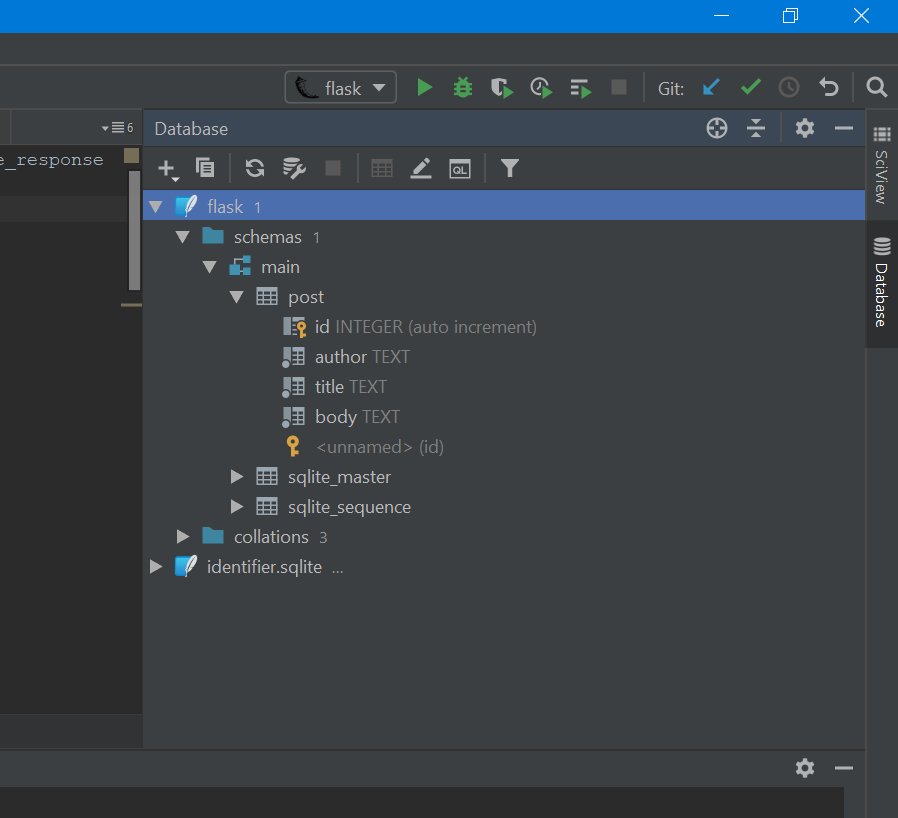
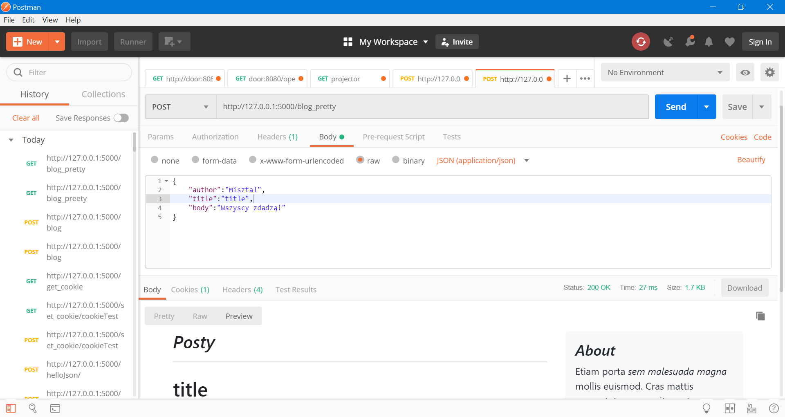

# FlaskExampleApp

Przykładowa aplikacja we Flasku

## Uruchamianie
Wszystkie mouduły potrzebne do uruchomienia aplikacja znajdują się w pliku requirements.txt.
```
pip install -r requirements.txt
```
Naprostszym sposobem uruchomienia jest użycie konsoli:
```
python app.py
```
Domyślnie aplikacja uruchamia się na porcie 5000. Opcjonalnie można skorzystać z następującego polecenia:
```
flask run
```
Lecz do niego potrzebujemy mieć zadeklarowaną zmienną środowiskową FLASK_APP z wartością nazwy głównego pliku, w którym znajduje się nasza aplikacja (systemy Unixowe):
```
$ export FLASK_APP=app
$ flask run
```
W przypadku Windows PowerShell:
```
$env:FLASK_APP = "app"
flask run
```
Pozwoli nam ono np. na uruchomienie aplikacji na innym porcie (np. 80):
```
flask run -p 80
```
W przypadku, gdy uruchamiamy projekt za pomocą PyCharm, nie musimy się przejmować zmiennymi środowiskowymi itp.

## Inicjalizacja bazy danych
Projekt korzysta z bazy SQLite - jest to baza plikowa. Do utworzenia pliku przechowującego tabelę wystarczy wywołać (musimy mieć zadeklarowaną zmienną FLASK_APP!):
```
flask init-db
```
Powstanie plik flask.sqlite przechowujący naszą tabelę.

W wypadku, gdy mamy PyCharm w wersji Professional (dostępne dla studentów pod tym [linkiem](https://www.jetbrains.com/student/)), 
możemy podejrzeć naszą bazę danych bezpośrednio z naszego IDE - po prawej stronie znajduje się zakładka Database, 
gdy przeciągniemy tam plik "flask.sqlite" i zainstalujemy sterownik, naszym oczom ukaże się:

##Wysyłanie zapytań
Na wykładzie do wysyłania zapytań wykorzystujących REST api wykorzystałem program [Postman](https://www.getpostman.com/).


## Testowanie
Przykładowe testy znajdują się w pliku [test_flask.py](test_flask.py). Można je uruchomić za pomocą:
```
pytest
```
Gdy nie podamy żadnego argumentu, zostaną uruchomione testy we wszystkich plikach z prefiksem test_ w bieżącym katalogu.
